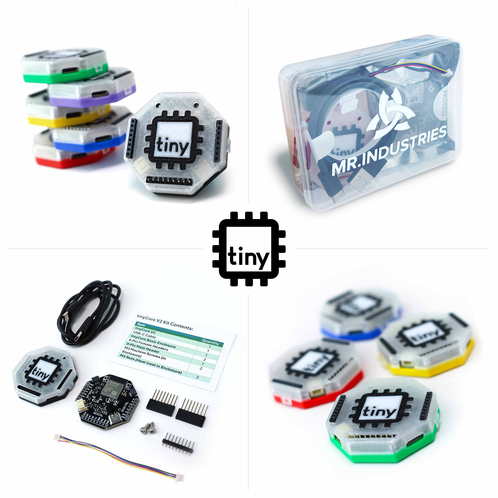
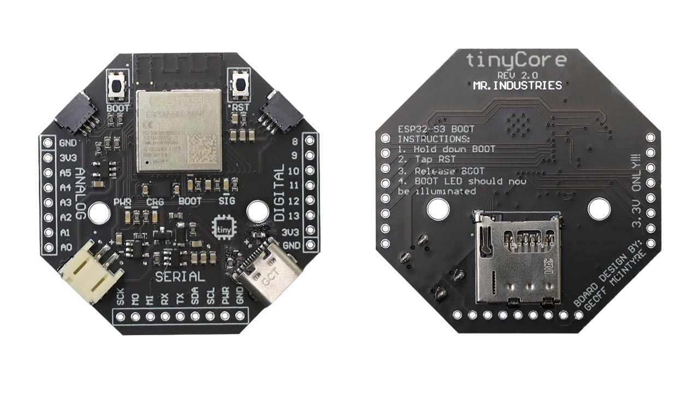
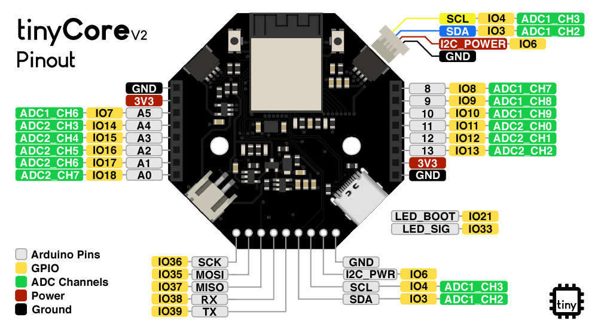

# tinyCore - A Better Way to Learn ESP32

ESP32-S3 chips are manufactured by Espressif®.
> Espressif® is a trademark of Espressif Systems (Shanghai) Co.Ltd (https://www.espressif.com/).

The tinyCore ESP32-S3 Board can be programmed with the Arduino® IDE.
> Arduino® is a trademark of Arduino LLC (https://www.arduino.cc/).

## Overview

tinyCore is an engineering learning platform based around an "open-knowledge" microcontroller board designed to help educate individuals on the world of advanced embedded systems. tinyCore’s mission is to bridge the gap between undergrad and industry, equipping young professionals with the resources they need to build their portfolio and bring their ideas to life. 

## Pinout

### Key Features

- **Processor**: ESP32-S3 Mini Dual-Core No-PSRAM
- **Connectivity**: 
  - WiFi & Bluetooth LE
  - USB-C
  - 2x STEMMA/QWIIC I2C Connectors
  - Micro SD Card Slot
  - Built-in LSM6DSO IMU
- **Power**: 
  - USB-C powered
  - LiPo battery support with charging circuit
  - Low power sleep modes, Dedicated I2C PWR Rail
- **Dimensions**: 50mm x 50mm

## Getting Started

Open up the "START-HERE.pdf" document, or check out [our documentation](https://docs.mr.industries) to get started.

## Purchase

If you would like to get a tinyCore for yourself, please [visit our website](https://mr.industries/tiny-core) to purchase one!

For professors, tax-exempt organizations, or bulk orders (>10), please contact us through the following email address:
[support@mr.industries](mailto:support@mr.industries)

## Hardware

The complete hardware design files are available in the [hardware folder](https://github.com/Mister-Industries/tinyCore/tree/main/Hardware), including:
- Schematic files 
- PCB layout files (Altium/KiCad format)
- Bill of Materials (BOM)
- Manufacturing files (Gerber)
- Assembly instructions

## Development

### Contributing

We welcome contributions! Please see our [Contributing Guide](CONTRIBUTING.md) for details on:
- Code style guidelines
- Development workflow
- Testing requirements
- Pull request process

## Community

- [Discord Server](https://discord.gg/hvJZhwfQsF)
- [Bluesky](https://bsky.app/profile/mr.industries)

## License

This project is licensed under the MIT License - see the [LICENSE](LICENSE) file for details.

## Acknowledgments
The tinyCore project thrives thanks to the generous support of our manufacturing and development partners:
### --- PCBWay ---

PCBWay provides exceptional PCB manufacturing services and has been instrumental in bringing tinyCore to life through their reliable prototyping capabilities. You can order our open-source designs directly from [their website](https://www.pcbway.com/project/shareproject/iota_The_Open_Source_Advanced_IoT_Learning_Platform_12776757.html)

Special thanks to:
- The Adafruit team for inspiration
- All of our open source contributors
- "Prof. Eric Bogatin, Prof. Chris Coulston, Tyler Watts, Chaz Havens and countless others who inspired me to create fantastic things." - Geoff M.

## Support

MR.INDUSTRIES offers comprehensive technical support for everyone in our tinyCommunity:

* Help with understanding documentation and setup challenges
* Replacement parts for defective components
* Expert guidance for your tinyCore projects
* Weekly "Office Hours" every Thursday at 4:30 MST on [Discord Server](https://discord.gg/hvJZhwfQsF)
  * Get 1-1 help from our engineers via Discord voice
* Active community support through our [Discord](https://discord.gg/hvJZhwfQsF)

## Star History

You can also send us an email to:
[support@mr.industries](mailto:support@mr.industries)

**Our team is committed to helping you succeed with your project every step of the way.**
